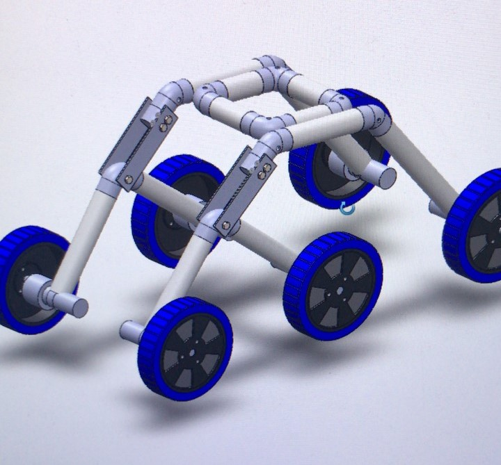
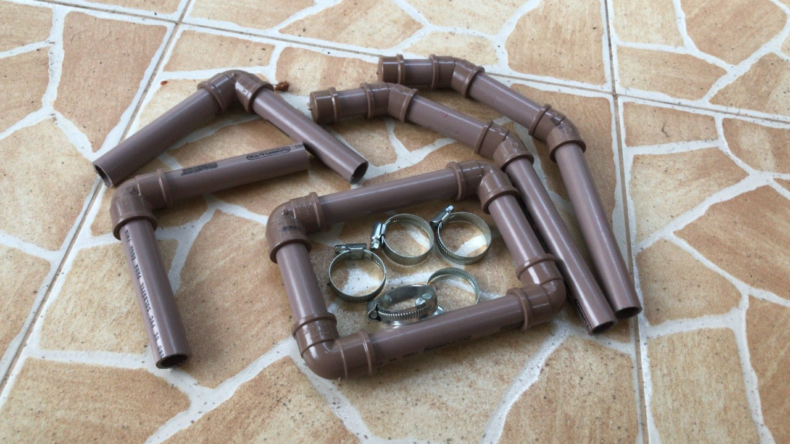
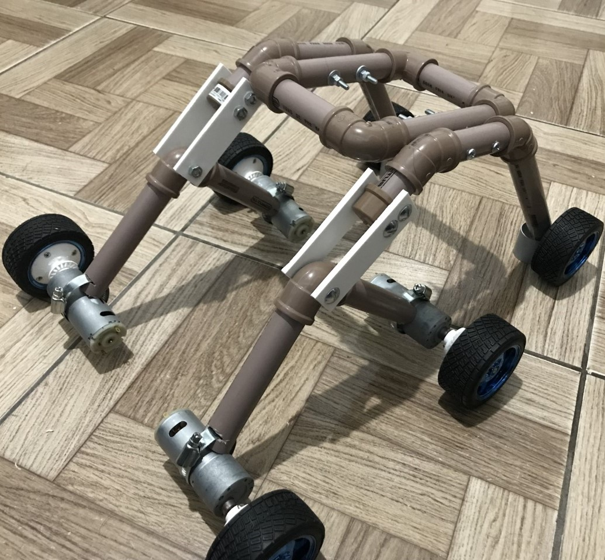
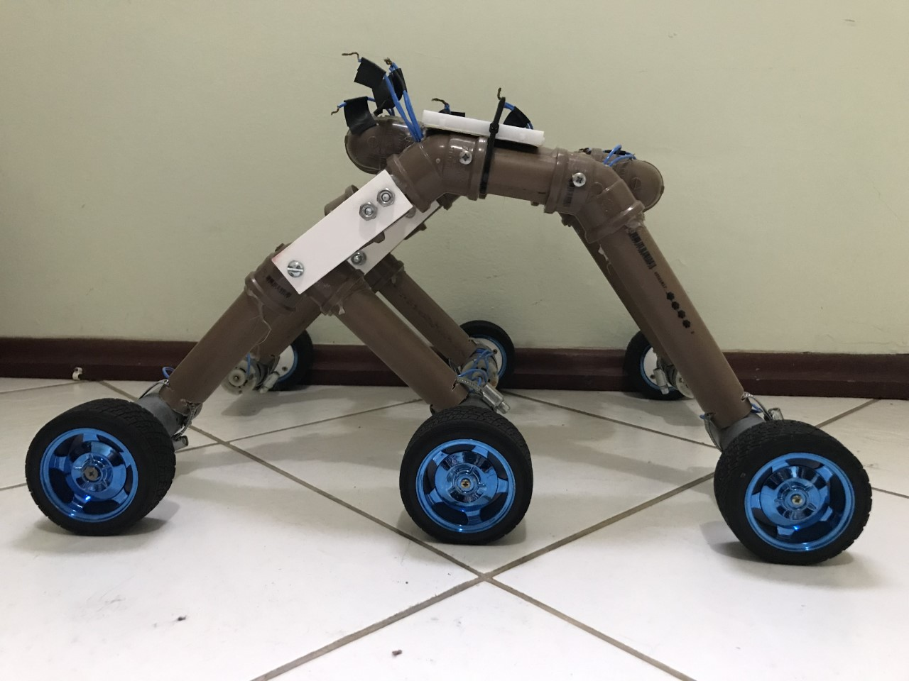

# Rover_Com_Lidar
Um robô do tipo Rover com estrutura Rocker-bogie acoplado com um sensor Lidar
Avanço do Rover durante o ano de 2021

Etapas de desenvolvimento
1.	Estudo dos componentes eletrônicos necessários
2.	Modelagem 3D
3.	Desenvolvimento da montagem das peças
4.	Primeiros testes com o Lidar
5.	Primeiros testes com a estrutura Rocker-Bogie
6.	Modelagem de um sistema de encoders para as rodas
7.	Novo estudo sobre os microcontroladores e formas de comunicação
8.	Atualização e refinação da estrutura Rocker-Bogie
9.	Testes com a estrutura enfrentando desafios
10.	Correção de problemas com as rodas
11.	Correção do Motor de passo
12.	Estudo da geração de mapas para a visualização da nuvem de pontos do Lidar
13.	Novos testes com o Lidar funcionando
14.	Etapas completas, necessário o desenvolvimento de soluções para possíveis erros
15.	Problema “ainda” sem solução no giro da estrutura Rocker-Bogie
Componentes eletrônicos utilizados

## Modelagem 3D
Antes da aquisição dos materiais necessários para a montagem do Rover foi desenvolvido em um programa de modelagem 3D AutoCAD (SolidWorks) uma simulação da estrutura Rocker-Bogie, essa simulação permitiu uma visualização mais detalhada da aparência e dimensões finais do projeto antes mesmo da montagem. 

 
Dessa forma todo o processo pode ser visualizado de maneira que seja possível evitar erros na quantidade, formato ou tamanho dos materiais que serão utilizados, a importância dessa etapa está em precisar os custos do projeto e diminuir as chances de desperdício de tempo na correção de possíveis erros futuros decorrentes de uma visualização não apurada da montagem.

## Montagem e problemas iniciais 
Com base na modelagem 3D é possível iniciar a montagem seguindo o desenho como referência. Na primeira etapa então foi feito os cortes nos canos para o tamanho adequado, é importante destacar que se viu necessário manter uma das pontas reta com o mínimo de deformação, tendo em vista que essa parte se conectaria com o motor e qualquer desvio na estrutura deixaria o motor desalinhado e com o seu giro prejudicado quando comparado com os outros motores.
Sem um kit profissional de corte e lixamento o processo se torna demorado e cansativo, porém é possível ser realizado utilizando-se de ferramentas como serras e lixas de papel.

Com os cortes feitos, bastava apenas a montagem.

 
A montagem ficou idêntica a simulação feita no SolidWorks, porém, nos primeiros testes realizados ficou evidente alguns problemas da estrutura. Os furos no qual passavam os parafusos que conectavam as partes de cima estavam desalinhados e por isso ocasionaram um erro que impedia a realização de movimentos mais complexos como por exemplo subir uma escada. 
As rodas evidenciaram outro problema ocasionado pelo método escolhido para prender a roda com o motor, o eixo do motor estava deslizando sem prender na roda, dessa forma, quando o motor se encontrava em uma região de alto atrito ou que necessitava de um alto torque as rodas giravam e falso.
No lidar a estrutura se comportou de maneira no qual havia sido prevista, não demonstrando então problemas ou erros aparentes.

 
Um desafio enfrentado no projeto foi nos testes realizados no motor de passo Nema 17, que ao comprar pela internet possuía em suas características um certo nível de torque mais que necessário para a estrutura em si, porém, quando o pacote chegou o motor se demonstrou diferente das características anunciadas. Devido a esse motivo a etapa de desenvolvimento do Lidar foi prejudica, já que foram testados diversos códigos diferentes com o pensamento de que o problema não era no hardware (por causa da falsa informação do anúncio), por fim foi decidido a compra de um novo motor de passo do tipo Nema 17 que não apresentou problema nenhum e funcionou perfeitamente.
Desenvolvimento da estrutura Rocker-Bogie

O falso giro das rodas impedia que o robô conseguisse executar tarefas mais difíceis como subir escadas, superar obstáculos e se movimentar em terrenos irregulares. A solução encontrada para este problema foi modelar um encaixe que se prendesse ao eixo do motor sem a necessidade de um parafuso ou material adesivo, para isso foi desenhado a entrada do suporte com o mesmo formato e dimensão do eixo do motor.
Para corrigir o desalinhamento da estrutura Rocker-Bogie foi necessário reconstruir todo o robô com novos materiais, além disso foi utilizado um cano mais grosso já que no primeiro caso a ruptura de alguns pontos eram comuns devido a espessura dos canos antes utilizados, dessa forma, a substituição dos materiais serviu não apenas para corrigir o alinhamento, mas também para garantir maior resistência do robô.

 
Nesse novo modelo a estrutura se apresentou eficiente no desenvolvimento de obstáculos e caminhos mais complexos, com os 6 motores somando um total de 60kg de torque, não houve nenhum problema de movimentação decorrente do peso total do robô. 

## Desenvolvimento do Lidar

O objetivo do Lidar era criar uma nuvem de pontos provenientes das leituras do sensor Infravermelho utilizado, o TF-Luna. Esse sensor possui um alcance significativamente alto quando comparado com outros modelos encontrados para comprar, com uma leitura de 8 metros esse sensor é capaz de mapear ambientes grandes sem a necessidade de se deslocar.
No começo do projeto foi pensado em utilizar algum sistema para enviar as leituras do sensor via bluetooth ou Wifi, com o objetivo de proporcionar maior articulação sem a necessidade do uso de algum fio de conexão, no entanto, foi optado o uso de uma conexão USB com o computador pois alguns problemas de envio de dados estavam sendo enfrentados na opção de Wifi ou Bluetooth. Dessa forma, o Lidar está funcionando conectado por um cabo USB ao computador, porém, isso foi previsto e pensado como uma situação coerente com o desenvolvimento do projeto esse ano, com o objetivo de nos próximos passos modificar a estrutura lógica para então utilizar um sistema sem fio. Pela imagem abaixo podemos ver o Lidar conectado ao computador.

